  

<h1 align="center">✨ Hi, I'm Gaber Hosny ✨</h1>

  <b>Cybersecurity · Penetration Testing · Network & Web Application Security</b> 
  <i>Breaking things responsibly, then writing down how to fix them.</i>

  
  

---

## 🛡️ About Me

Cybersecurity practitioner focused on **offensive security**. I test web applications and networks for exploitable weaknesses, then document clear, reproducible remediation steps. Comfortable on the Linux command line and with the standard pentesting toolchain.

- 🔭 **Currently building:** hands-on web security labs covering the OWASP Top 10
- 🌱 **Currently learning:** advanced penetration testing, Active Directory attack paths, and Python automation for recon
- 🎯 **2026 goal:** earn eJPT / CompTIA Security+ and contribute to open-source security tooling
- 💬 **Ask me about:** web vulnerability research, network security, Linux hardening
- 📫 **Reach me:** gaberhosny2020@gmail.com

---

## 🧰 Tech & Tools

**Security**

**Systems & Networking**

**Development**

---

## 🚀 What I'm Working On

**Web Security Labs** — PHP · MySQL
Building and breaking deliberately vulnerable web applications to practise the OWASP Top 10: SQL injection, XSS, CSRF and broken access control — each lab paired with a short write-up on the fix.

**Nexus Auto Platform** — TypeScript
Full-stack platform build, designed with secure authentication and strict input validation from the first commit.

> Repositories are being prepared for public release — write-ups and tooling coming soon.

---

## 📜 Certifications

- **Cisco CCNA** — Routing, Switching & Network Fundamentals
- *In progress:* eJPT / CompTIA Security+

---

Open to junior cybersecurity / SOC analyst / penetration testing opportunities.

